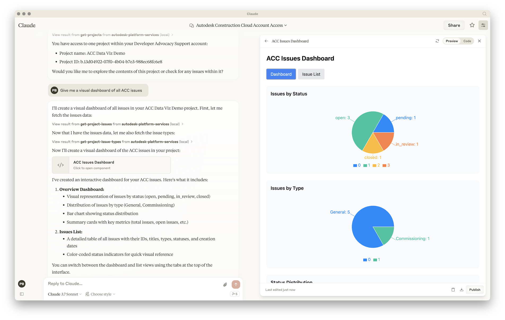

# aps-mcp-server

Experimental [Model Context Protocol](https://modelcontextprotocol.io) server build with Node.js, providing access to [Autodesk Platform Services](https://aps.autodesk.com) API, with fine-grained access control using the new _Secure Service Accounts_ feature.



[YouTube Video](https://youtu.be/6DRSR9HlIds)

## Development

### Prerequisites

- [Node.js](https://nodejs.org)
- [APS app credentials](https://aps.autodesk.com/en/docs/oauth/v2/tutorials/create-app) (must be a _Server-to-Server_ application type)
- [Provisioned access to ACC or BIM360](https://get-started.aps.autodesk.com/#provision-access-in-other-products)

### Setup

#### Server

- Clone this repository
- Install dependencies: `yarn install`
- Build the TypeScript code: `yarn run build`
- Create a _.env_ file in the root folder of this project, and add your APS credentials:
    - `APS_CLIENT_ID` - your APS application client ID
    - `APS_CLIENT_SECRET` - your APS application client secret
- Create a new service account: `npx create-service-account <username> <first name> <last name>`, for example, `npx create-service-account ssa-test-user John Doe`
    - This script will output a bunch of environment variables with information about the new account:
        - `APS_SA_ID` -  your service account ID
        - `APS_SA_EMAIL` - your service account email
        - `APS_SA_KEY_ID` - your service account key ID
        - `APS_SA_PRIVATE_KEY` - your service account private key
- Add these environment variables to your _.env_ file

#### Autodesk Construction Cloud

- Register your APS application client ID as a custom integration
- Invite the service account email as a new member to your ACC project(s)

### Use with Inspector

- Run the [Model Context Protocol Inspector](https://modelcontextprotocol.io/docs/tools/inspector): `yarn run inspect`
- Open http://localhost:5173
- Hit `Connect` to start this MCP server and connect to it

### Use with Claude Desktop

- Make sure you have [Claude Desktop](https://claude.ai/download) installed
- Create a Claude Desktop config file if you don't have one yet:
    - On macOS: _~/Library/Application Support/Claude/claude\_desktop\_config.json_
    - On Windows: _%APPDATA%\Claude\claude\_desktop\_config.json_
- Add this MCP server to the config, using the absolute path of the _build/server.js_ file on your system, for example:
```json
{
    "mcpServers": {
        "autodesk-platform-services": {
            "command": "node",
            "args": [
                "/absolute/path/to/aps-mcp-server/build/server.js"
            ]
        }
    }
}
```
- Open Claude Desktop, and try some of the following test prompt:
    - What ACC projects do I have access to?
    - Give me a visual dashboard of all issues in project XYZ

> For more details on how to add MCP servers to Claude Desktop, see the [official documentation](https://modelcontextprotocol.io/quickstart/user).

### Use with Visual Studio Code & Copilot

- Make sure you have [enabled MCP servers in Visual Studio Code](https://code.visualstudio.com/docs/copilot/chat/mcp-servers#_enable-mcp-support-in-vs-code)
- Create _.vscode/mcp.json_ file in your workspace, and add the following JSON to it:

```json
{
    "servers": {
        "Autodesk Platform Services": {
            "type": "stdio",
            "command": "node",
            "args": [
                "/absolute/path/to/aps-mcp-server/build/server.js"
            ]
        }
    }
}
```

> For more details on how to add MCP servers to Visual Studio Code, see the [documentation](https://code.visualstudio.com/docs/copilot/chat/mcp-servers)

### Use with Cursor

- Create _.cursor/mcp.json_ file in your workspace, and add the following JSON to it:

```json
{
  "mcpServers": {
    "Autodesk Platform Services": {
      "command": "node",
      "args": [
        "/Users/brozp/Code/Temp/aps-mcp-server-node/build/server.js"
      ]
    }
  }
}
```

> For more details on how to add MCP servers to Cursor, see the [documentation](https://docs.cursor.com/context/model-context-protocol)